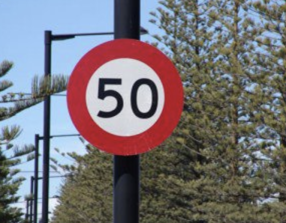
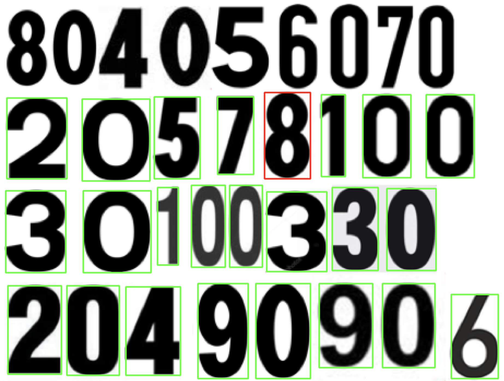
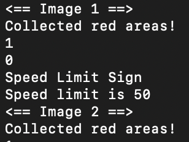

# ⛔ Traffic Signs Recognition ⚠️


## Abstract:

Carrying out accurate and efficient Traffic Signs recognition is becoming a key element in modern vehicles. Self-driving cars require traffic signs detection in order to properly parse and understand the road, whereas Driver Alert systems inside new cars need it to understand the road and therefore help protect drivers and keep them in check. Throughout this project, I attempted to use Machine Learning Algorithms to implement a Traffic Signs Recognition System that will be able to differentiate between multiple road signs, and display the speed limits.

## Demo:

Original Sign          |  Digit Training
:-------------------------:|:-------------------------:
 |  

Post-Extraction        |  Terminal
:-------------------------:|:-------------------------:
 |  

## Table of contents:

- [Requirements](#requirements)
  - [Homebrew](#homebrew)
  - [OpenCV](#opencv)
- [How to run the program](#how-to-run-the-program)
- [Algorithms and Techniques](#algorithms-and-techniques)
  - [Color Extraction](#color-extraction)
  - [Haar Cascades](#haar-cascades)
  - [Traffic Signs Classification](#traffic-signs-classification)
  - [Digit Training](#digit-training)
  - [Speed Limit Recognition](#speed-limit-recognition)
  - [Visualization](#visualization)
- [Performance](#performance)
- [Improvements](#improvements)
- [References](#references)

## Requirements:

### Homebrew

If on macOS, use the following command to install Homebrew:

``` bash
> /usr/bin/ruby -e "$(curl -fsSL https://raw.githubusercontent.com/Homebrew/install/master/install)"
```

### OpenCV:

If on macOS, follow the instructions to install openCV:

Install OpenCV

``` bash
> brew install opencv
```

Install pkg-config

``` bash
> brew install pkg-config
```

## How to run the Program:

Use the following commands

``` bash
> g++ $(pkg-config --cflags --libs opencv) -std=c++11  main.cpp -o output
./output
```

## Algorithms and Techniques:

### Overview:

The program follows a rigorous approach to detecting the Traffic Signs. In fact, it starts with a color based step, where the program detects every red pixel, and gathers the regions using a clustering algorithm. Then, using a Machine Learning algorithm and specifically Haar Cascades that I pre-trained, the traffic sign is classified into the corresponding class (Speed Limit, Warning etc...). At last, and in case of a speed limit sign, the program uses a different Machine Learning Algorithm which is the K-nearest neighbor algorithm as well as a modified OCR Tesseract to detect and display the Speed Limit.

### Color extraction:

During this step, the programs begins by converting the image's color scheme from RGB to HSV, then using an inRange function detects and masks all the red areas.

```cpp
// Convert from RGB to HSV
cvtColor(img, img, COLOR_BGR2HSV);
// Mask the red color
Mat mask1, mask2;
inRange(img, Scalar(0, 50, 20), Scalar(5, 255, 255), mask1);
inRange(img, Scalar(170, 50, 20), Scalar(180, 255, 255), mask2);
Mat1b mask = mask1 | mask2;
```

To gather all the red pixels into regions, the program uses a clustering algorithm known as Partition which splits an element set into equivalency classes.

For more information regarding the Partition clustering, check [here](https://docs.opencv.org/2.4/modules/core/doc/clustering.html#partition).

Original Sign          |  Post-Extraction
:-------------------------:|:-------------------------:
 |  

```cpp
// Clustering algorithm: Partition
int tmp = radiusTolerance * radiusTolerance;
int labelNum = partition(pts, labels, [tmp](const Point& lhs, const Point& rhs){
    return ((lhs.x - rhs.x)*(lhs.x - rhs.x) + (lhs.y - rhs.y)*(lhs.y - rhs.y)) < tmp;
});
```

All the points in the same cluster are saved in a vector, and then the formed bounding rectangles represent the regions to be analyzed later.

### Haar Cascades:

For better results, training my own Haar Cascades seems to be necessary. To do that, there are a few steps to follow.

In fact, to build a proper dataset, both a set of positive samples and negative samples were needed (with negatives being at least double the number of positives). Alongside the sample, a list of all the names of the samples is required. This can easily be done using the command:

``` bash
> find ./positiveSamples -iname "*.jpeg" > positivesamples.txt
> find ./negativeSamples -iname "*.jpeg" > negativesamples.txt
```

In case the dataset is not large enough, rotating the images and changing the perspective can help enlarge the dataset.
To train the dataset, I have used opencv_traincascade.

At the end, it will result in a XML file.

The same steps were followed to get multiple Haar Cascades for different categories.

### Traffic Signs classification

Using the pre-trained Haar Cascades, the program classfies the traffic signs into their corresponding categories, whether it is a warning sign, speed limit sign etc... 

``` c++
for (int j=0; j<redAreas.size(); j++){
    Mat img = loadedImg(Rect(redAreas[j]));
    vector<Mat> waningsigns = detectWarningSigns(img, warning_cascade);
    if(waningsigns.size()>0){
        cout<<"Warning Sign"<<endl;
    }

    vector<Mat> speedlimitsigns = detectSpeedLimitSigns(img, speed_limit_cascade);
    if(speedlimitsigns.size()>0){
        cout<<"Speed Limit Sign"<<endl;
        ...
    }
    else {
        cout<<"Sign not recognized..."<<endl;
    }
}
```

### Digit Training:

To recognize the speed limit stated on the Speed Limit signs, training our machine learning model on digits was required. In fact, I attempted to create my own OCR tesseract engine that uses the K-Nearest Neighbor algorithm. Because the speed limit signs have usually a similar font, I used a very small dataset to train the model.

The training is done by first loading the image that contains all the digits, then selecting the digits by contour finding and applying constraints on the area and heights of numbers to avoid false detections. A rectangle is drwan around the digit to help the user see where the model is, and waits for him to click on the corresponding digit, if it is a false detection the user will then click on space. Once the corresponding digit key is pressed, it saves 150 pixel values in an array and the manually entered digit in a second array following the same order. Those arrays are then saved in txt files to avoid redoing the training everytime.

Right after that, the txt files are loaded, the instance of the classifier K-Nearest Neighbor is created, and then used for training the model.


``` c++
// Follow the hierarchy order
for (int i=0; i<contourPoints.size(); i=hierarchy[i][0]){

    // Get the bouding rectangle of contour
    Rect rec = boundingRect(contourPoints[i]);
    rectangle(original, Point(rec.x,rec.y), Point(rec.x+rec.width, rec.y+rec.height), Scalar(0,0,255), 2, LINE_8, 0);

    // Crop the image
    Mat roi = thresh(rec);

    // Resize it to 15 by 15px
    resize(roi, roi, Size(15, 15), 0, 0, INTER_LINEAR);

    // Convert it to float
    roi.convertTo(roi, CV_32FC1);

    imshow("original", original);

    // Get the num manually from user or space if not number
    int digit = waitKey(0);

    // Convert ASCII to int
    digit -= 0x30;

    // Store label in a matrix
    labelMat.push_back(digit);

    // When labeled, rectangle becomes green
    rectangle(original,Point(rec.x, rec.y), Point(rec.x+rec.width, rec.y+rec.height), Scalar(0,255,0), 2, LINE_8, 0);

    // Store the 225px of the roi, and make it continuous
    digitMat.push_back(roi.reshape(1,1));
}
```

### Speed Limit Recognition:

If the sign is classified as a Speed Limit Sign, the image is then processed for speed limit recognition. Using the trained model (See previous section), we extract the speed limit. The image is processed to extract every digit using contour detection, a rectangle is drawn around each digit, and then the K-Nearest Neighbor algorithm is used to match the trained data with the extracted numbers. I am using the function KNearest.find_nearest() to match them.

``` c++
// Follow the hierarchy order
for (int i=0; i<contoursPoints.size(); i=hierarchy[i][0]){
    Rect r = boundingRect(contoursPoints[i]);
    Mat roi = thresh(r);
    resize(roi, roi, Size(10,10), 0, 0, INTER_LINEAR);
    roi.convertTo(roi,CV_32FC1);

    Mat closeLabel;
    float p = knn -> findNearest(roi.reshape(1,1),4, closeLabel);
    char name[4];
    sprintf(name, "%d", (int)p);
    result = result + to_string((int)p);
    putText(res, name, Point(r.x,r.y+r.height), 0, 1, Scalar(0, 255, 0), 2, LINE_8);
}
```
### Visualization:

Regarding the visualization, the steps are shown in the terminal, alongside the rectangles (ROI) on the image.


## Performance:

By running the algorithm over a couple of images (both positive and negative), I concluded the following:

- The Traffic Signs Recognition system overall has around 92% accuracy.
- After running the OCR engine (digit recognition) on over a hundred images, it appears that it has over 98% accuracy.

## Improvements:

- Train more Haar Cascades on other traffic signs types and cover some from other countries (training cascades takes time).
- Integrate this project with my previous Real Time Road Lane Detection system (both done using OpenCV and C++).

## References:

P. Shopa, N. Sumitha and P. S. K. Patra, "Traffic sign detection and recognition using OpenCV," International Conference on Information Communication and Embedded Systems (ICICES2014), 2014, pp. 1-6, doi: 10.1109/ICICES.2014.7033810.

Yamada K., Aryuanto and Limpraptono F. Y., “Intelligent machine vision system for traffic sign recognition”, November 2008.

Escalera A. D. L., Armingol J. M., and Mata M., “Traffic sign recognition and analysis for intelligent vehicles” Image and Vision Computing, vol. 21, no. 3, pp. 247-258, 2002.

Fang C. Y., Fuh C. S., and Chen S. W., “Detection and tracking of road signs” Pattern Recognition and Image Analysis, vol. 11, no. 2, pp.  304-308, 2001.


